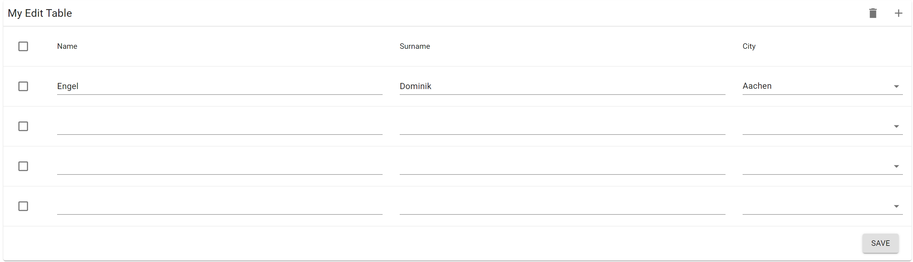
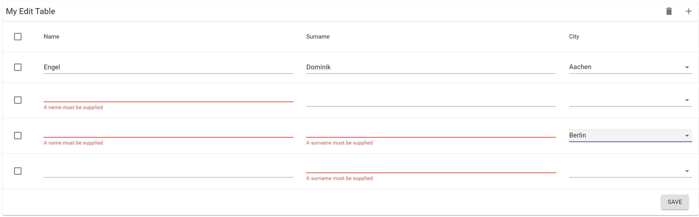

# Material Table Edit Component

This package is an editable table for material-ui.

Every cell is editable out of the box and new rows can be added or deleted.

Internally, it uses [Formik](https://github.com/jaredpalmer/formik) and validation with [YUP](https://github.com/jquense/yup).

## Screenshot





## Requirement

To use editable-material-table, you must use react@16.8.0 or greater which includes hooks.

## Installation

This package is distributed via [npm](https://www.npmjs.com/package/editable-material-table).

```
$ yarn add editable-material-table
# or
$ npm install --save editable-material-table
```

## Getting Started

- import and render `EditableTable`
- Add the data and column props
- optional add YUP validation
- Wait for the onSubmit save call


## Author

- [Dominik Engel](https://github.com/Domino987)

This project follows the all-contributors specification. Contributions of any kind welcome!

Built with [TSDX](https://github.com/jaredpalmer/tsdx)